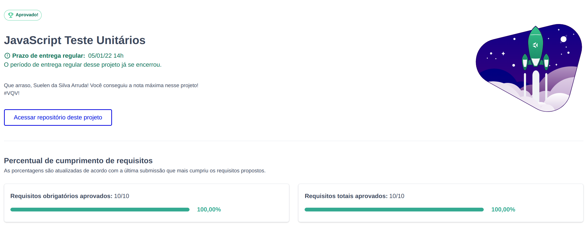

#  Project JS Unit Tests

## Habilidades

- Escrever testes unitários para funções utilizando o Jest para verificar o correto funcionamento dessas funções;
- A partir de testes já implementados, escrever funções de forma que elas atendam aos testes propostos;
- Escrever testes e funções utilizando uma abordagem de desenvolvimento orientado a testes.

---

 

### O que será desenvolvido

Você implementará várias funções para atender aos requisitos propostos e/ou testes unitários para garantir que as implementações das funções estão corretas.

 

## Stack utilizada
  

 

## Status do projeto

## 🔗 Links

---
